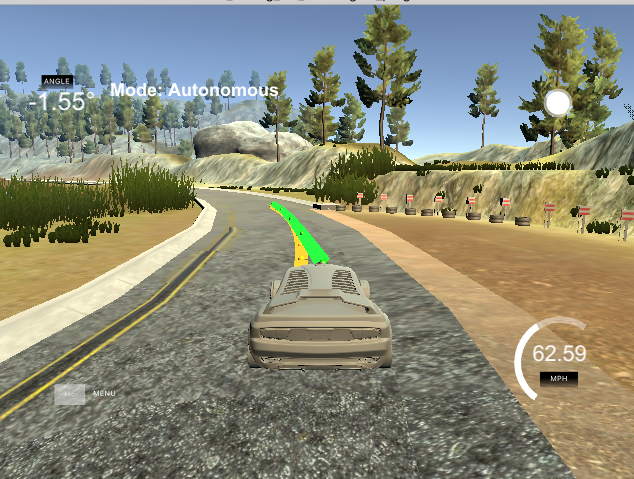

# Model Predictive Control

This program drives a car around a map where a known list of waypoints and distance to waypoints can be obtained.

This was a project in the second term of the Self-Driving Car Engineer Nanodegree Program at Udacity.




The idea behind MPC is to predict where the vehicle will go and use that information to construct an optimal set actuations. To do this we need to know how the actuations change the vehicles state and we have to know where we want the vehicle to travel (a path of sorts).

Given a set of upcoming waypoints we can construct a smooth curve that connects them. This is our ideal path for the vehicle, and to make things simple a third degree polynomial is fit.

The vehicles state is described by its x and y position, its heading (psi), the speed v (assumed in the direction of the heading). Its location in the world is judged primarily by cross track error (cte) and the error in the heading angle vs the ideal heading (epsi). The state is updated by adjusting the steering angle and throttle. 

The objective is to derive a set of actuator inputs (steering and throttle) that will lead to a predicted path similar to the ideal curve we calculated earlier. To do this, we predict the next state at each point in our new theoretical curve using the dynamics implied by the vehicle. A scoring function is created that captures all the properties we would like: low cross track error, smooth actuator inputs, target speed, correct vehicle heading etc. The solution is then given by a non linear solver.

In this project, I decided to use N=12 future actuations to calculate the predicted vehicle path. These points were separated temporally by dt = .1  ( 100 ms). This was chosen as a compromise for computation time and effectiveness. Larger values of N lead to larger more complex optimization problems while too small values of dt do not give enough physical resolution (all actuations too close in time) to have a well planned path. Large N values (> 20) were tried at first, but lead to the solver taking too long. Also large dt values (> .5 ) were tried and lead to erratic behavior. I set the cte and heading terms of the score to a high weight, and while I set a high target speed of 80mph, I made it relatively unimportant in the score function. This allowed the vehicle to travel at high speed when by all other metrics it was safe to do so.

The simulator had a predictable 100 ms latency, to deal with this, instead of using the vehicle's current position as the starting value for the MPC solver, I used the vehicles position in 100ms as the input.

The results can be found here:

<video controls="controls" width="auto" height="480" name="tuned" src="https://github.com/cochoa0x1/mp-control/blob/master/imgaes/movie.mov"></video>

---

## Dependencies

* cmake >= 3.5
 * All OSes: [click here for installation instructions](https://cmake.org/install/)
* make >= 4.1
  * Linux: make is installed by default on most Linux distros
  * Mac: [install Xcode command line tools to get make](https://developer.apple.com/xcode/features/)
  * Windows: [Click here for installation instructions](http://gnuwin32.sourceforge.net/packages/make.htm)
* gcc/g++ >= 5.4
  * Linux: gcc / g++ is installed by default on most Linux distros
  * Mac: same deal as make - [install Xcode command line tools]((https://developer.apple.com/xcode/features/)
  * Windows: recommend using [MinGW](http://www.mingw.org/)
* [uWebSockets](https://github.com/uWebSockets/uWebSockets)
  * Run either `install-mac.sh` or `install-ubuntu.sh`.
  * If you install from source, checkout to commit `e94b6e1`, i.e.
    ```
    git clone https://github.com/uWebSockets/uWebSockets 
    cd uWebSockets
    git checkout e94b6e1
    ```
    Some function signatures have changed in v0.14.x. See [this PR](https://github.com/udacity/CarND-MPC-Project/pull/3) for more details.
* Fortran Compiler
  * Mac: `brew install gcc` (might not be required)
  * Linux: `sudo apt-get install gfortran`. Additional you have also have to install gcc and g++, `sudo apt-get install gcc g++`. Look in [this Dockerfile](https://github.com/udacity/CarND-MPC-Quizzes/blob/master/Dockerfile) for more info.
* [Ipopt](https://projects.coin-or.org/Ipopt)
  * Mac: `brew install ipopt`
  * Linux
    * You will need a version of Ipopt 3.12.1 or higher. The version available through `apt-get` is 3.11.x. If you can get that version to work great but if not there's a script `install_ipopt.sh` that will install Ipopt. You just need to download the source from the Ipopt [releases page](https://www.coin-or.org/download/source/Ipopt/) or the [Github releases](https://github.com/coin-or/Ipopt/releases) page.
    * Then call `install_ipopt.sh` with the source directory as the first argument, ex: `bash install_ipopt.sh Ipopt-3.12.1`. 
  * Windows: TODO. If you can use the Linux subsystem and follow the Linux instructions.
* [CppAD](https://www.coin-or.org/CppAD/)
  * Mac: `brew install cppad`
  * Linux `sudo apt-get install cppad` or equivalent.
  * Windows: TODO. If you can use the Linux subsystem and follow the Linux instructions.
* [Eigen](http://eigen.tuxfamily.org/index.php?title=Main_Page). This is already part of the repo so you shouldn't have to worry about it.
* Simulator. You can download these from the [releases tab](https://github.com/udacity/self-driving-car-sim/releases).
* Not a dependency but read the [DATA.md](./DATA.md) for a description of the data sent back from the simulator.


## Basic Build Instructions


1. Clone this repo.
2. Make a build directory: `mkdir build && cd build`
3. Compile: `cmake .. && make`
4. Run it: `./mpc`.